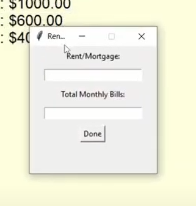

# Money-marvel

Money Marvel is a simple budget calculator built using Python that helps you manage your personal finances by calculating your spending budget and providing a budget plan based on the 5:3:2 rule of spending. With this calculator, you can quickly and easily get a sense of how much money you should spend on rent, bills, and food each month while also setting aside some savings.


* [Click here](https://blog.cheekety.com/simple-budget-calculator-with-pysimplegui/) to read the final project blog article.
* Author: [Teniola Ajani](https://www.linkedin.com/in/abdulhameedajani/)

## Installation

To run the Python script, you need to have Python 3 installed on your machine. You can clone this repository or download the script directly. Then, navigate to the directory where the script is located and run the following command in your terminal:
 ```sh
 python3 Budget_tool.py
 ```
 To run the GUI app, you can run it using vscode
 
 
## Usage

When you run the Python script or the GUI app, you will be prompted to input your budget. The tool will calculate your recommended spending and savings amounts based on the 5:3:2 rule. You can then choose to view your budget plan or your spending budget.

To view your budget plan, select option 1 and choose how much you want to save (20% or 30%). The tool will display your spending, savings, and extra amounts.

To view your spending budget, select option 2 and enter your monthly rent/mortgage and bills. The tool will display how much you have left for food and other expenses.

## Contributing

Feel free to contribute to this project by creating pull requests or opening issues on GitHub. You can also contact the author for suggestions or feedback.

## Related projects

Here are some similar projects that you might find useful:

* [Mint](https://www.mint.com/)
* [Personal Capital](https://www.personalcapital.com/)
* [YNAB (You Need a Budget)](https://www.youneedabudget.com/)

---


